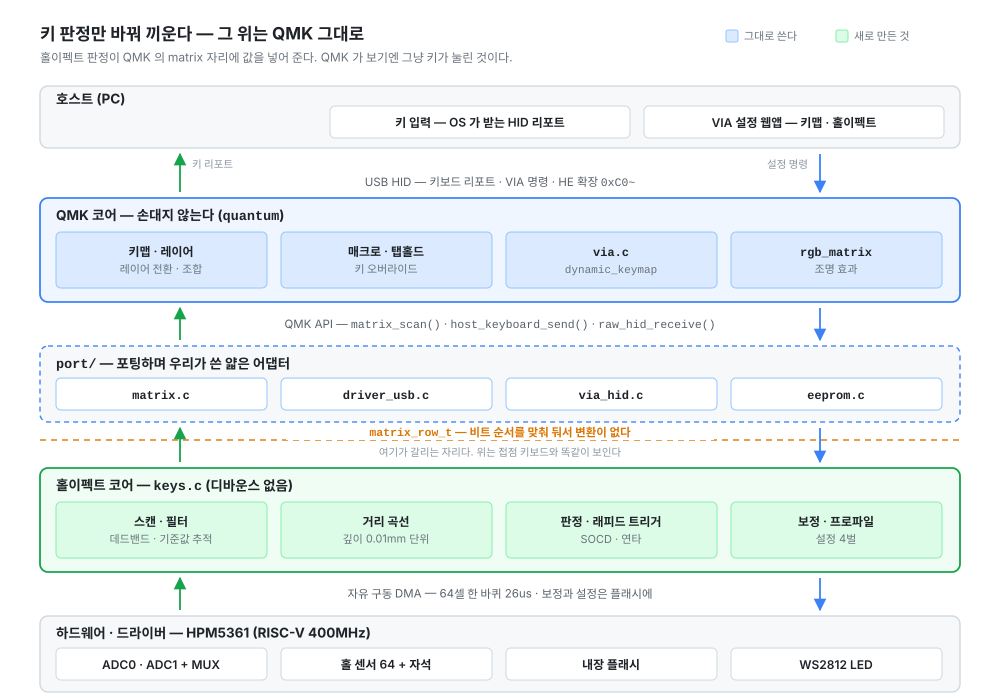
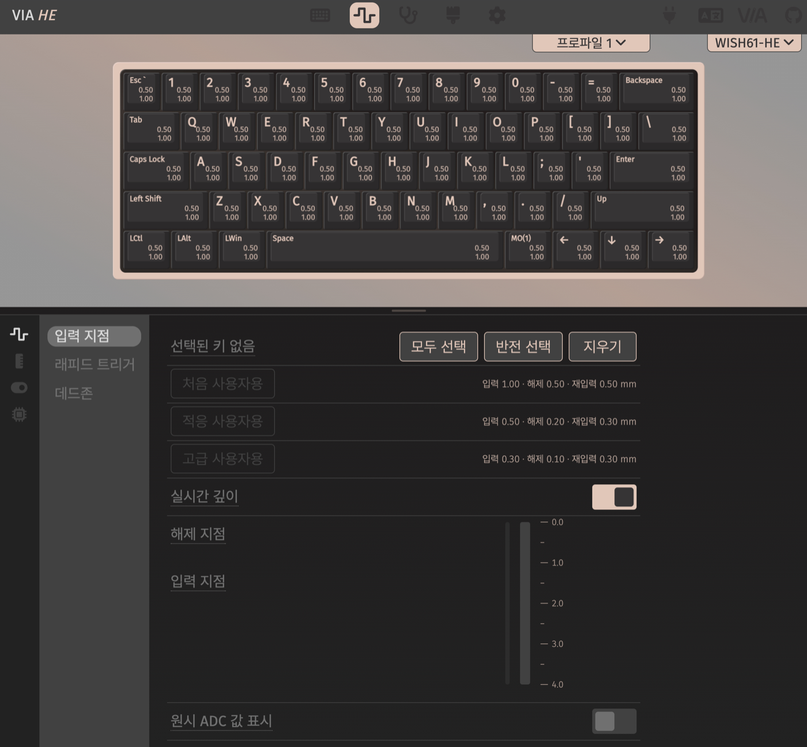

# wish-he

상용 홀이펙트 키보드에 올리는 커스텀 펌웨어다. HPM5361(RISC-V, 400MHz) 위에서 돈다.

**QMK/VIA 를 최소한의 수정으로 포팅하고, 홀이펙트는 그 아래에 끼워 넣었다.** 그래서
레이어·매크로·탭홀드 같은 QMK 기능과 VIA 설정을 **하나도 잃지 않은 채** 홀이펙트를
같이 쓴다. 둘 중 하나를 고르지 않아도 된다.

### 설정은 브라우저에서 → https://chcbaram.github.io/via-he/

크롬 계열이면 케이블만 꽂으면 붙는다. 설치할 것이 없고, 펌웨어도 거기서 바로 굽는다.

---

## 지원 PCB

PCB 를 따로 만들지 않는다. 아래 보드에 그대로 올라간다.

| 보드 | 상용 보드 | 빌드 이름 | 키 | LED | USB |
|---|---|---|---|---|---|
| **WISH60 HE (7U)** | Geonworks VENOM60HE 7U | `wish60-he-7u` (기본) | 63 | 83 | `0483:5304` |
| **WISH61 HE** | EverGlide AE61 Pro | `wish61-he` | 61 | 104 | `0483:5305` |

키 수는 레이아웃 옵션 소켓까지 센 자리 수다. 스플릿 백스페이스 같은 자리는 여럿 중
하나만 끼우므로 실제로 쓰는 키는 그보다 적다.

**부트로더는 보드에 원래 있던 것을 그대로 둔다.** 우리 몫은 앱 자리뿐이라 언제든
순정으로 되돌릴 수 있고, wish61-he 는 되돌릴 이미지를 따로 내려받을 필요도 없다.

## 컨셉 — QMK 를 바꾸지 않는다

홀이펙트 펌웨어는 대개 키 판정을 새로 만들면서 그 위까지 같이 만든다. 그러면 레이어도
매크로도 설정 도구도 처음부터 다시 짜야 하고, 쓰던 QMK 기능이 하나씩 빠진다.

여기서는 **키 판정만 바꿔 끼웠다.** QMK 가 키보드를 읽는 자리(matrix)에 홀이펙트
판정 결과를 그대로 넣어 준다. QMK 가 보기에는 그냥 키가 눌린 것이라 **그 위 로직은
손댈 것이 없다.**



| | |
|---|---|
| **QMK 기능이 그대로** | 레이어·매크로·탭홀드·키 오버라이드·조명. 빠진 것이 없다 |
| **VIA 웹앱이 그대로 붙는다** | 프로토콜을 흉내 낸 것이 아니라 QMK 의 `via.c` 를 그대로 쓴다 |
| **HE 설정도 같은 곳에서** | VIA 채널 확장으로 얹어, 키맵과 홀이펙트를 한 화면에서 만진다 |
| **디바운스가 없다** | 접점이 없어 바운스도 없다. 채터링을 기다리던 시간이 통째로 빠진다 |
| **판정은 스캔 주기로** | 래피드 트리거는 0.01mm 단위 방향 반전을 본다. QMK 루프에 묶이면 놓친다 |

포팅하며 우리가 쓴 것은 `port/` 계층(matrix·USB·EEPROM·raw HID)뿐이다. 자세한 것은
[10편 — QMK 를 matrix 아래에 얹기](firmware/wish-he/docs/10-qmk.md).

## 무엇이 홀이펙트인가

기계식 스위치는 눌렸다/안 눌렸다 둘뿐이지만, 홀이펙트는 **자석이 얼마나 가까운지**를
읽어 **깊이를 0.01mm 단위로** 안다. 그래서 이런 것이 된다.

| | |
|---|---|
| **입력 지점** | 얼마나 눌러야 입력으로 칠지 키마다 따로 정한다 |
| **래피드 트리거** | 깊이와 무관하게 **되돌린 거리**로 뗀다. 연타가 빨라진다 |
| **스위치 종류** | 자석이 다르면 곡선이 다르다. 데이터시트 두 점만 넣으면 장치가 곡선을 만든다 |
| **보정** | 키를 끝까지 눌러 그 키의 실제 전 행정을 잰다 |
| **프로파일** | 설정 4벌. 키맵·조명까지 통째로 갈아 끼운다 |

## 설정 도구도 VIA 그대로

설정 웹앱은 VIA 를 포크해 **홀이펙트 탭을 더한 것**이다. 키맵·레이어·매크로·조명은
쓰던 VIA 화면 그대로 쓰고, 거기에 탭 하나가 붙는다.



키보드 그림에 **키마다 지금 값이 그대로 찍힌다.** 여러 키를 골라 한꺼번에 바꾸고,
입력 지점·래피드 트리거·데드존을 프로파일별로 둔다. 실시간 깊이를 켜면 누르는 대로
막대가 움직여서, 숫자를 짐작으로 고르지 않아도 된다.

## 굽기

웹페이지에서 바로 굽는다. JTAG 도 UART 도 필요 없다 — **USB 하나면 된다.**

소스에서 직접 빌드하려면 이렇다.

```sh
cd firmware/wish-he
tools/build.sh                 # wish60-he-7u
tools/build.sh wish61-he
```

굽다 만 보드도 되살아난다. 부트로더는 자기 자신을 못 덮어쓰고, 앱은 부팅할 때 자기
CRC 를 검사해 어긋나면 스스로 업데이트 모드로 돌아간다. 그 상태로 위 웹페이지를 열면
펌웨어 화면이 바로 뜬다.

## 이 저장소

```
firmware/wish-he/
  src/          펌웨어
  keyboards/    보드별 레이아웃·키맵
  docs/         설계 문서
  tools/        굽기·측정·릴리즈
```

설계와 구현은 [firmware/wish-he/docs](firmware/wish-he/docs/README.md) 에 편으로
나눠 두었다 — 하드웨어, 스캔과 판정, 거리 곡선, 래피드 트리거, USB, 지연까지
00~18편이다. 빌드와 굽는 법도 거기에 있다.

설정 웹앱은 별도 저장소다 → [chcbaram/via-he](https://github.com/chcbaram/via-he)
