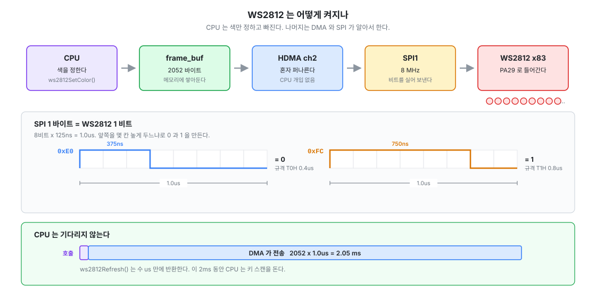

# 4. WS2812 (SPI + DMA)

> 전체 목차는 [README.md](README.md) 를 본다.

외부 LED 가 없으므로 네오픽셀이 유일한 시각 표시다. 키 스캔에 들어가기 전에
**DMA 사용법을 먼저 검증**하는 목적도 있었고, 실제로 함정 두 개를 미리 잡았다.



---

## 하드웨어

| 항목 | 값 |
|---|---|
| 데이터 핀 | **PA29 = SPI1.MOSI (ALT5)** |
| SCLK | **8 MHz** — SPI 1바이트 = 1.0us = WS2812 1비트 |
| LED 개수 | 83, GRB 순서 |
| 비트 인코딩 | `0` → `0xE0`(0.375us high), `1` → `0xFC`(0.75us high) |
| 프레임 | 60 + 83×24 + 60 = **2112 B** |

PA29 먹싱은 IAP 가 이미 해주지만 자립을 위해 `ws2812Init()` 에서 다시 잡는다.

## CLI

```
ws2812 info / all <r> <g> <b> / set <ch> <r> <g> <b> / off
ws2812 test        흐르는 점
ws2812 rainbow     무지개 회전
```

## ★ 전류 예산

채널당 풀스케일 약 20mA, LED 1개 흰색이면 약 60mA. **83개를 전부 흰색 255 로 켜면 약 5A** 다.

```
83개 흰색 v  ->  v × 19.5 mA
83개 단색 v  ->  v ×  6.5 mA
```

USB 선언은 500mA. MCU·USB·홀센서를 빼면 LED 몫은 200~300mA 이므로
**전체 흰색은 v ≈ 10~15, 전체 단색은 v ≈ 30~45** 가 상한이다.
나중에 **프레임 전류 합산 리미터**(총합 초과 시 전체 비례 축소)를 넣는 것이 정석이다.

---

## ★ 겪은 것 네 가지

### ① HDMA 채널은 전역 자원이다

WS2812 를 채널 0 에 잡았는데 `uart.c` 가 UART0 RX 로 이미 쓰고 있어 서로 덮어썼다.
레지스터를 읽으니 `SRCADDR` 이 UART0 데이터 레지스터를 가리켜 바로 드러났다.

```c
#define HW_DMA_CH_UART0_RX     0
#define HW_DMA_CH_WS2812       2
/*      HW_DMA_CH_ADC          3~  (예정) */
```

**우선순위는 채널 번호와 무관하다.** 채널마다 `CHCTRL[n].CTRL` bit29 로 따로 주며
2단계(LOW/HIGH)뿐, 기본값은 LOW. ADC 는 HIGH 로 갈 것 — 스캔 타이밍이 밀리면 키 입력이
튀지만 LED 는 2ms 늦어도 보이지 않는다.

### ② `dma_check_transfer_status()` 는 유휴 판정용이 아니다

완료 플래그가 하나도 없으면 **`ONGOING` 을 돌려준다.** 즉 한 번도 안 쓴 채널이
"진행 중"으로 보여서 첫 전송이 계속 거부됐다. "시작 후 완료 확인용" 함수이므로
시작 시점을 자체 `is_busy` 플래그로 기억해야 한다. 게다가 W1C 라 읽는 순간 지워진다.

### ③ DMA 는 D-cache 를 보지 않는다

전송 전에 `l1c_dc_writeback()` 으로 프레임버퍼를 메모리까지 밀어내야 한다.

### ④ 부팅 시 소등이 안 되던 문제

IAP 도 SPI1 로 LED 를 켠다(부트로더 표시로 ESC 키가 초록). 넘어온 직후에는 전송이
아직 안 끝나 SPI 가 active 라 첫 `spi_setup_dma_transfer()` 가 busy 로 거부됐다.
`ws2812 off` 는 되는데 부팅 소등만 안 되는 증상이었다.

```c
(void)spi_wait_for_idle_status(WS2812_SPI);
(void)spi_poll_reset_complete(WS2812_SPI, spi_reset_all, 1000);
```

그리고 **프레임 앞에도 리셋 구간(60us low)을 둔다.** 뒤쪽만 두면 첫 LED 가 선두 바이트를
잘못 받는다 — WS2812 는 GRB 순서라 그 증상이 "초록" 으로 나타난다.

> 버퍼만 지우고 끝내면 소용없다. WS2812 는 마지막 값을 래치하므로 `ws2812Init()` 에서
> **실제로 `ws2812Refresh()` 를 불러야** 꺼진다.
