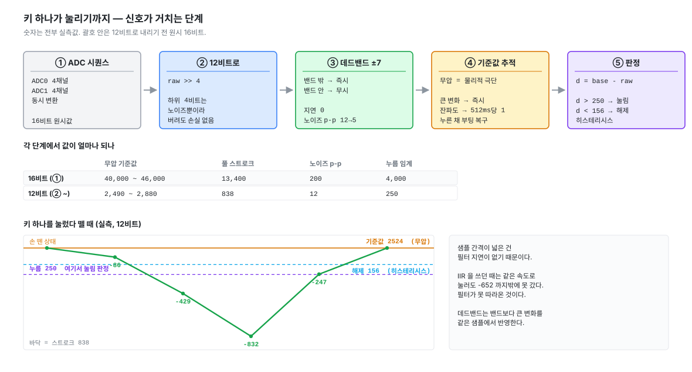

# 6. 눌렸다 말았다를 정하기

> 전체 목차는 [README.md](README.md) 를 본다.

5편에서 얻은 원시값을 눌림/해제로 바꾼다. 결과는 QMK 의 `matrix_row_t` 와 비트 순서가
같은 행 비트마스크라, 상위 계층은 이 보드가 홀이펙트인지 일반 매트릭스인지 모른다.



```c
bool     keysGetPressed(uint16_t row, uint16_t col);   /* row = MUX 스텝, col = ADC 채널 */
uint16_t keysGetRow(uint16_t row);
```

## 먼저 잰 것

설계를 정하기 전에 스위치 하나를 눌러 방향과 크기를 확정했다.

```
cli# keys map
  s5 / ch1   delta   -834   (raw 39484, base 40318)
  s5 / ch1   delta  -9161   (raw 31157, base 40318)
  s5 / ch1   delta -13358   (raw 26960, base 40318)   <- 끝까지
```

| | 16비트 | 12비트 |
|---|---|---|
| 방향 | **누르면 내려간다** | |
| 풀 스트로크 | 13,400 | **838** |
| 셀 간 기준값 편차 | 5,800 | 360 |
| 무압 노이즈 p-p | 200 | **12** (±6) |

**스트로크가 셀 간 편차의 2.3배**라는 게 중요하다. 이 여유 덕분에 "이 셀은 눌린 채로
측정됐다"를 중앙값 비교로 판별할 수 있다.

## 12비트로 내린다

노이즈 p-p 가 16비트로 약 200 이다. 하위 4비트(16)는 그보다 한참 작아 정보가 없다.
`>> 4` 로 버리면 테이블이 절반이 되고, 상수가 읽히고, 8편 EEPROM 저장량도 절반이 된다.

상용 보드도 매 스캔 처리의 첫 줄에서 같은 일을 한다.

> *(분석 인용은 옮기지 않는다)*

그렇게 보면 상용의 작은 상수들이 우리 실측과 같은 자리에 있다.

| 상용 (12비트) | 우리 |
|---|---|
| 데드밴드 ±7 | 노이즈 ±6 |
| 임계값 212 | 누름 임계 250 |

## 필터 — IIR 을 버리고 데드밴드로

처음에는 1차 IIR(1/4)을 썼다. 노이즈는 줄었지만 **지연이 그대로 입력 지연이 된다.**

```
63% 정착   4 스캔  =  152us
90% 정착   9 스캔  =  342us
```

상용 보드는 데드밴드를 쓴다. 밴드보다 큰 변화는 **같은 샘플에서 즉시** 반영되므로
지연이 0 이고, 밴드 안쪽 잔파도는 출력에 아예 나타나지 않는다. 기준값 추적기가 노이즈
꼭대기를 붙잡는 걸 막는다는 목적도 그대로 달성된다.

```c
if      (v > o + KEYS_DEADBAND) o = v - KEYS_DEADBAND;
else if (v < o - KEYS_DEADBAND) o = v + KEYS_DEADBAND;
```

바꾸고 재보니 **두 축이 같이 좋아졌다.**

| | IIR | 데드밴드 |
|---|---|---|
| 노이즈 진폭 (p-p) | 9 ~ 16 | **1 ~ 10** |
| 필터 지연 | 152us / 342us | **0** |
| 같은 속도로 눌렀을 때 도달 깊이 | -652 | **-832** (스트로크 838) |

마지막 줄이 지연의 실물 증거다. IIR 일 때는 같은 손가락 속도로 눌러도 필터가 못 따라와
스트로크의 78% 만 보였다. `keys map` 곡선이 매끄러웠던 것도 손가락이 아니라 필터의
모양이었다.

데드밴드는 누적 상태가 없어 12비트에서 바로 돌아간다. IIR 이었다면 `p + ((v-p) >> 2)`
가 차이 4 미만에서 0 이 되어 마지막 몇 카운트를 못 따라가는 문제를 피하려고 상태를
16비트로 따로 들고 있어야 했는데, 그 복잡함도 같이 사라졌다.

### 지연 예산 — 레퍼런스 대비

상용 보드는 이미 8kHz 저지연으로 동작하는 검증된 구현이라 비교 기준이 된다.

| 단계 | 상용 | 우리 |
|---|---|---|
| ADC 설정 (12비트, clk_div 4, sample_cycle 5) | 확인 | 동일하게 채택 |
| 스캔 한 바퀴 | ~38us (구조 동일, 추정) | 38us (실측) |
| 필터 | 0 | **0** |
| 리포트 대기 (8kHz 폴링) | 0 ~ 125us | 0 ~ 125us |
| **합** | **40 ~ 165us** | **40 ~ 165us** |

7편에서 리포트 경로를 같은 방식(완료 콜백에서 즉시 재무장)으로 만들면 동등해진다.

## 기준값은 고정값이 아니다

안 눌린 상태가 **물리적 극단**이다 — 자석이 가장 멀어 값이 가장 크다. 그러니 기준값을
고정값이 아니라 그 극단을 좇는 값으로 두면 셋이 한꺼번에 풀린다.

- 키를 **누른 채 부팅** → 손을 떼는 순간 제 값을 찾는다
- **온도 드리프트** → 계속 따라간다
- **개체 편차** → 셀마다 제 기준을 갖는다

```c
if (v > base) {
  if (v - base > KEYS_LATCH_JUMP) base = v;    /* 진짜 해제 — 즉시 */
  else if (drift_due)             base++;      /* 노이즈 잔파도 — 시간 기준 */
}
d = base - v;                                  /* 누를수록 커진다 */

if (drift_due && d > 0 && d < KEYS_DRIFT_BAND) base--;
```

부팅 씨앗값은 **버리는 스캔 128 + 평균 1024** (약 52ms). 앞쪽을 버리는 건 전원 인가
직후 ADC 레퍼런스와 센서 바이어스가 자리잡기 전 값을 평균에서 빼기 위해서다.
그 뒤 중앙값보다 크게 낮은 셀은 "눌린 채 측정됨"으로 보고 중앙값으로 밀어둔다.

판정은 스트로크의 30% 에서 눌림, 19% 에서 해제 — 그 사이가 히스테리시스다.

---

## 겪은 함정

### ① 드리프트 밴드가 간발의 차로 빗나가 있었다

손을 뗐는데 `keys map` 이 쉬지 않고 -303 ~ -308 을 찍었다.

기준값이 러닝 극값이라 **구조적으로 노이즈 꼭대기에 걸린다.** 그래서 평상시 편차가
노이즈만큼(약 307) 남는 건 정상이다. 문제는 보정 조건이었다.

```c
#define KEYS_DRIFT_BAND  300
if (d > 0 && d < KEYS_DRIFT_BAND) { ... }   /* d = 307 -> 창 밖 -> 한 번도 안 돈다 */
```

밴드를 **해제 임계값에 묶어** 임의의 숫자를 고르지 않게 했다. 뜻이 "안 눌린 동안은
계속 보정"이 된다. (나중에 노이즈와 액추에이션 사이로 다시 좁혔다 — 해제 임계값까지
열면 손가락을 살짝 얹은 상태까지 보정 대상이 되어 기준값이 눌린 쪽으로 끌려간다.)

동시에 원시값에 IIR 평활을 넣어 노이즈를 근원에서 줄였다. 기준값 들림이 +104 → +38.

### ② 드리프트 주기를 스캔 횟수로 셌다

`keys watch` 에서 편차가 -40 ~ -120 에 머물고 줄지 않았다. 보정이 안 도는 게 아니라
**사실상 얼어 있었다.**

```
keys watch (delay 50)   20 회/초      -> 1카운트 내리는 데 51초
7편 메인 루프           26000 회/초   -> 39ms
```

스캔 속도가 호출자마다 1000배 넘게 다르다. **온도 드리프트는 물리 현상이니 ms 로 센다.**

### ③ 위아래 기준이 달라 7편에서 깨질 뻔했다

②를 고쳐도 비대칭이 남아 있었다.

```
하강   32ms 마다 -1        시간 기준,  고정
상승   노이즈 꼭대기마다   스캔 기준,  20 ~ 26000회/초
```

CLI(20회/초)에서는 하강이 이기지만, 메인 루프에서 초당 26,000회가 되면 꼭대기를 잡을
기회가 1,300배 많아져 균형점이 위로 밀린다. **증상이 나기 전에 예측해서** 상승도 시간
기준으로 바꿨다 — 큰 변화(진짜 해제)만 즉시 반영하고 나머지는 대칭으로.

---

## 검증

```
cli# keys noise
진폭 (p-p)                          중심
  1 ~ 10  (대부분 4 ~ 7)             -2 ~ +2  (전 셀)
37148 회 스캔 / 3초
```

전 셀 중심이 ±2 다 — 12비트 해상도에서 기준값 추적이 거의 완벽히 수렴한다.
진폭이 0 이 아니라는 건 필터가 신호를 과하게 죽이지 않았다는 뜻이다.

`keys base` 에 스위치 장착 여부도 드러난다. 자석이 들어오면 그 셀만 내려간다.

```
장착   s3/ch1 2493   s5/ch1 2522   s7/ch1 2526
빈칸   나머지 2643 ~ 2876
```

다만 `present[]` 를 이 값으로 자동 판별하지는 않는다. 최소 간격이 스트로크의 13% 뿐이라
온도·개체차로 흔들리고, 64개가 전부 장착되면 중앙값이 옮겨가 기준 자체가 무너진다.
**키맵에서 유도한다** — 레이아웃에 없는 자리는 없는 것이다 (7편).

## 남은 것

- [ ] 64셀 ↔ 실제 키 위치 매핑. `keys map` 으로 하나씩 눌러 표를 만든다
- [ ] ADC1(ch4~7)과 MUX 스텝 0·1·2·4·6 은 아직 실제 키로 반응을 못 봤다.
      스위치를 가로로 흩어지게 꽂아 확인해야 한다
- [ ] `ch0·ch1·ch2` (PB07·PB06·PB04) 의 노이즈가 나머지보다 조금 높다. 차이가 작아
      지금은 무해하지만 12편에서 다시 본다
- [ ] 밴드 7 은 실측 노이즈 ±6 바로 위라 경계가 아슬아슬하다. 진폭이 큰 셀
      (`s7/ch0` 등 10)은 가끔 밴드를 넘는다. 12편에서 셀별로 조정할지 본다
