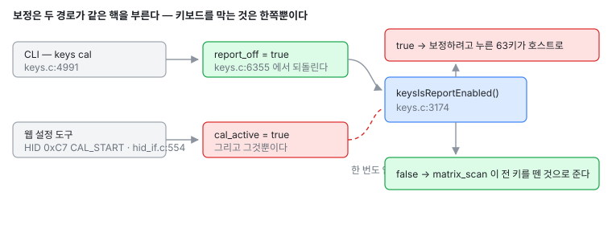

# 001 — 보정 중에 키가 호스트로 입력된다

| | |
|---|---|
| 이슈 | <https://github.com/chcbaram/wish-he/issues/1> |
| 신고 | 2026-08-30, `SuFl3770` |
| 신고된 환경 | 61키 HE 보드, 펌웨어 `v260829R1` |
| 분석한 소스 | `264f451` (`V260915R1`) |
| 상태 | 분석 끝, 미수정 |
| 자리 | 리포트 문지기, `src/hw/driver/keys.c` |

## 증상

보정은 모든 키를 한 번씩 끝까지 눌러야 끝난다. 웹 설정 도구로 그걸 하는 동안 누른
키가 **그대로 호스트로도 입력된다.** Backspace 는 페이지를 뒤로 보내고 Super 는 시작
메뉴를 열어서 보정 화면이 빠지거나 가려진다. 보고자는 브라우저에서 포커스를 뺀 채로
보정하는 것으로 피해 가고 있다.

## 무슨 일이 일어나는가

보정 자체는 CLI 와 HID 가 같은 핵을 쓴다 — `keysCalStart()` · `keysCalCollect()` ·
`keysCalSave()`. 그런데 **리포트를 막는 일은 그 핵에 안 들어 있다.** CLI 명령 루프
옆에만 붙어 있다.



문지기는 보정을 안 본다 (코드에서 읽음).

```c
/* src/hw/driver/keys.c:3174 */
bool keysIsReportEnabled(void)
{
  if (report_off) return false;

  /* 주입 중이면 명시할 때만 내보낸다 */
  if (inject_live == false)
  {
    for (uint32_t st = 0; st < KEYS_STEP_MAX; st++)
      if (inject_mask[st]) return false;
  }
  return true;
}
```

`report_off` 는 `cliKeys()` 가 대화형 명령 목록 — `cal` · `map` · `learn` ·
`layout` · `show` · `bar` · `watch` · `noise` · `raw` · `led` — 을 보고 켜고
(`keys.c:4991`), 명령이 끝날 때 끈다 (`keys.c:6355`). HID 경로는 아무것도 안 켠다.

```c
/* src/hw/driver/usb/cherryusb/hid_if.c:554 */
case HID_CAL_START:
  keysCalStart();
  cal_save_ok = cal_save_skip = 0;
  break;
```

그래서 콘솔로 하는 `keys cal` 은 조용하고, 웹 도구로 하는 같은 보정은 63키를 포커스
잡힌 창에 그대로 타이핑한다.

`keys.c:3216` 주석은 이미 반대를 전제로 적혀 있다 — *"보정 중에는 리포트를
막아두므로 키 조합을 종료 신호로 쓸 수 있다."* **그 전제가 CLI 에서만 참이다.**

## 왜 지금까지 안 드러났나

핵을 CLI 루프 밖으로 뺀 것은 웹 도구가 같은 것을 쓰게 하려던 것이다 (`keys.c:3270`
주석에 그렇게 적혀 있다). 그때 수집·판정·저장은 따라 나왔는데 **차단은 핵이 아니라서
한쪽에 남았다.**

## 고칠 자리

부르는 쪽마다 붙이지 말고 **문지기에 둔다.** 모든 리포트가 반드시 지나는 한 곳이라,
나중에 보정을 시작하는 세 번째 길이 생겨도 같이 걸린다.

```c
/* src/hw/driver/keys.c — keysIsReportEnabled() */
bool keysIsReportEnabled(void)
{
  if (report_off) return false;

  /*
   * 보정 중에도 막는다. 보정은 63키를 다 눌러야 끝나는 일이라 그게 호스트로 가면
   * 화면이 뒤집힌다. CLI 는 report_off 로 덮인 길이 있었고 HID 는 없었다 —
   * 문지기에 두면 어느 경로로 시작하든 같다.
   */
  if (keysCalIsActive()) return false;
  ...
}
```

`cal_active` 는 이 함수보다 뒤(`keys.c:3286`)에 선언돼 있으니 변수를 앞으로 옮기지
말고 `keysCalIsActive()` 를 쓴다. 파일의 "초기화 먼저, 헬퍼는 뒤" 배치가 안 깨진다.

종료 제스처는 그대로 산다. `keysComboHeld()` 는 호스트 리포트가 아니라
`keysGetPressed()` 를 직접 본다.

### ★ 탈출구를 같이 넣어야 한다

지금은 `cal_active` 가 켜진 채 남아도 해로울 게 없다. 문지기가 그걸 보기 시작하는
순간, 끝나지 않은 보정은 **뽑았다 꽂기 전까지 아무 글자도 안 내보내는 키보드**가
된다 — 브라우저 탭을 닫으면 `HID_CAL_CANCEL` 이 안 온다. 둘을 같이 넣는다.

1. **무응답 해제.** 설정 도구는 진행률을 그리려고 `HID_CMD_CAL` 을 계속 묻는다.
   그게 몇 초(5초쯤) 안 오면 `keysCalCancel()` 한다. 화면이 살아 있으면 시계는 계속
   밀린다.
2. **키보드만으로 빠져나오기.** CLI 는 `keysCliKeep()` 안에서 Ctrl+Esc 취소를 받는다.
   HID 경로에는 그게 없다. 콘솔이 없는 사용자도 빠져나올 수 있어야 한다.

### 생각했다가 접은 길

| 대안 | 왜 안 되나 |
|---|---|
| HID 핸들러에서 `report_off` 를 켠다 | 같은 뜻의 깃발이 두 곳에서 서게 된다. 다음 진입점이 하나를 빠뜨린다 — 이 버그가 정확히 그렇게 왔다 |
| 호스트가 정하게 한다 (`CAL_START` 에 깃발) | 키보드가 살아 있을지를 언제든 닫힐 수 있는 웹 페이지에 맡기는 셈이다 |
| 아픈 키만 거른다 (Backspace, Super) | 나머지는 여전히 타이핑되고, 종료 제스처도 더는 안전하지 않다 |

## 시험

`tools/he_test.py` 의 `host` 무리에 넣는다. HID 로 `CAL_START` 를 보내고 `keys inject`
로 키를 눌러 호스트 리포트가 비어 있는지 보고, `CAL_CANCEL` 로 닫은 뒤 리포트가 다시
사는지까지 본다. 무응답 해제를 넣었으면 **묻기를 멈추고 잠시 뒤 키가 되살아나는지**도
같은 시험에서 본다.

되돌리는 순서는 지킨다 — **설정을 먼저, 주입을 나중에.** 반대로 하면 그 사이 리포트가
살아나 스턱 키가 샌다.

## 굽기 전후로 재는 것

분기 하나가 느는 것뿐이지만 숫자는 그래도 적어 둔다 — `keys time`, `qmk reset` 뒤
`qmk info`.

## 다른 세션에서 집을 수 있는 것

| 할 일 | 하드웨어 | 나오는 것 |
|---|---|---|
| 웹 도구가 보정 화면에서 상태를 주기적으로 묻는지 확인 | 불필요 | `via-he` 저장소를 읽으면 된다. 무응답 해제가 성립하는지가 여기서 갈린다 |
| 문지기 한 줄 + 탈출구 둘 구현 | 굽기·확인에 필요 | 위 수정안. 탈출구 없이 문지기만 먼저 넣지 않는다 |
| `he_test.py` 에 재현 절차 추가 | 필요 | 고치기 전에 넣어 **빨간 것을 먼저 본다** |
| 보정 안내 문구가 CLI 와 웹에서 같은 말을 하는지 | 불필요 | "평소 치는 힘으로" 가 웹 쪽에도 있는지 (`keys.c:5460` 의 근거) |

## 아직 안 잰 것

- 설정 도구가 정말 주기적으로 상태를 묻는가. 무응답 해제가 여기 달려 있다.
  이 저장소에서는 못 본다.
- 키 하나하나 천천히 보정하는 사람을 안 끊는 시간이 몇 초인가.
