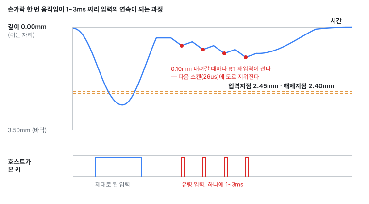
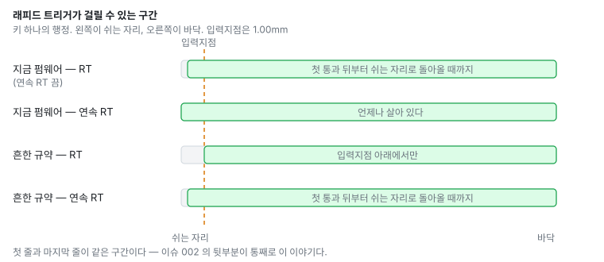

# 002 — 입력지점 위에서 1~3ms 짜리 유령 입력

| | |
|---|---|
| 이슈 | <https://github.com/chcbaram/wish-he/issues/2> |
| 신고 | 2026-08-31, `SuFl3770` |
| 신고된 환경 | 61키 HE 보드, 펌웨어 `v260829R1` |
| 분석한 소스 | `264f451` (`V260915R1`) |
| 상태 | 분석 끝. 원인 A 는 명백한 버그, 원인 B 는 결정이 남았다 |
| 자리 | `keysTrack()`, `src/hw/driver/keys.c` |

> 모르는 말이 나오면 [README 의 "자주 나오는 말"](README.md#자주-나오는-말) 을 본다.

## 세 줄 요약

- **증상** — 키를 완전히 떼지 않고 다시 누르면, 입력지점 한참 위에서 1~3ms 짜리
  짧은 입력이 나간다. 연속 RT 를 켜도 입력이 유지되지 않는다.
- **원인** — 둘이다. **(A)** RT 가 세운 눌림을 다음 순간 절대 해제가 도로 지운다.
  **(B)** 연속 RT 를 꺼도 RT 가 전 행정에서 살아 있다.
- **고칠 자리** — A 는 `keysTrack()` 의 절대 해제 기준 한 줄. B 는 **규약을 정하는
  결정이 먼저다.**

## 증상

입력지점 2.45mm, 해제지점 2.40mm, 래피드 트리거 켬, 재입력 거리 0.10mm.

- **연속 RT 끔** — 완전히 떼지 않고 다시 누르면, 입력지점에 한참 못 미친 자리에서
  아주 짧은 입력(1~3ms)이 나간다.
- **연속 RT 켬** — 재입력 거리만큼 눌러도 입력이 유지되지 않고 역시 1~3ms 만 나간다.

빈도는 재입력 거리 설정값에 따라 달라진다.

**한 신고 안에 서로 다른 원인 둘이 들어 있다.** A 는 두 모드에서 같이 나고, B 는
"연속 RT 를 껐는데 왜 거기서 걸리나" 쪽이다.

---

## 원인 A — 눌린 것이 한 스캔 뒤에 도로 지워진다

### 쉽게 말하면

판정에는 **두 가지 기준**이 같이 돌고 있다.

- **RT** — "직전보다 0.10mm 내려갔으니 눌린 걸로 친다"
- **절대 해제지점** — "깊이가 2.40mm 보다 얕으면 뗀 걸로 친다"

손가락이 얕은 곳(0.3mm 쯤)에 있을 때 RT 가 "눌렸다" 고 세워 놓으면, 바로 다음
순간 절대 해제지점이 "2.40mm 보다 얕은데?" 하고 도로 떼 버린다. **액셀을 밟는
순간 브레이크가 같이 밟히는 셈이다.**

그래서 키는 26us(스캔 한 바퀴) 동안만 눌렸다가 떨어진다. 그게 PC 에 1~3ms 짜리
유령 입력으로 보인다.



### 차례대로

보고자의 설정을 `keysTrack()` 에 그대로 넣고 따라가면 (코드에서 읽음) —

1. 2.45mm 를 넘는다 → 눌림. 정상이다.
2. 0.30mm 쯤까지 올라온다 → RT 해제. 이것도 정상이다.
3. 거기서 0.10mm 를 다시 누른다 → RT 재입력이 눌림을 세운다.
4. **바로 다음 스캔** — 깊이(0.40mm쯤)가 해제지점 2.40mm 보다 얕으니 절대 해제가
   걸려 떼진다. 눌린 지 26us 만이다.
5. 3~4 가 내려가는 내내 0.10mm 마다 되풀이된다.

### 코드로 확인

```c
/* src/hw/driver/keys.c:2628 — 눌려 있는 동안 */
if (rt_active && !in_bottom &&
    (int32_t)peak[step][c] - d >=
      (int32_t)t->rt_release[keysRtZone(idx, peak[step][c])])
{
  pressed[step] &= (uint16_t)~bit;    /* RT 해제 */
  peak[step][c]  = (uint16_t)d;
}
else if (d < (int32_t)t->release)      /* 절대 해제 — 항상 유효하다 */
{
  pressed[step] &= (uint16_t)~bit;
  peak[step][c]  = (uint16_t)d;
}
```

**들어오는 쪽은 이미 이 문제를 겪고 고쳐 뒀다.** 바로 아래 떼진 가지(`keys.c:2699`)는
RT 가 걸린 동안 절대 입력지점을 일부러 안 본다. 둘을 `or` 로 묶었다가 올라오는 내내
같은 글자가 쏟아졌던 일이 주석에 그대로 적혀 있다. 나가는 쪽만 그 처리를 못 받았다.

| | RT 가 걸린 동안 절대 문턱을 보나 |
|---|---|
| 들어오는 쪽 (입력지점) | 안 본다 — 의도적으로 막아 뒀다 |
| 나가는 쪽 (해제지점) | **본다** — 이게 이번 버그다 |

유령 입력이 매번 안 나가는 것도 같이 설명된다. 눌림 표시는 26us 동안만 서 있고,
QMK 가 그걸 훑는 주기는 훨씬 길다 — **창이 겹칠 때만** PC 로 간다. 그래서 솔직한
연속 입력이 아니라 짧고 들쭉날쭉한 것으로 보인다.

### 왜 지금까지 안 드러났나

절대 해제는 **재입력이 해제지점보다 얕은 곳에서 일어날 때만** 끼어든다.

- 기본값(입력 1.00mm / 해제 0.50mm) — 재입력이 대개 0.50mm 보다 깊어서 안 걸린다.
- 보고자 설정(입력 2.45mm / 해제 2.40mm) — 행정의 **거의 전부**가 해제지점 위라
  늘 걸린다.

그 줄은 신고된 펌웨어보다 오래됐다 — `2c1958e` 이후 그대로라 `v260829R1` 에도 들어
있다.

### 고칠 자리

안전망은 남기고 **무엇과 견주는지만 바꾼다.** RT 가 걸린 동안 절대 해제는 "원위치로
돌아왔다" 만 뜻해야 한다.

```c
/*
 * 절대 해제 — RT 가 걸린 동안에는 "원위치로 돌아왔다" 만 본다.
 *
 * ★ 사용자 해제지점을 그대로 쓰면 RT 재입력이 그보다 얕은 곳에서 걸렸을 때
 *   다음 스캔에 지워진다 — 26us 짜리 유령 입력이 된다.
 *
 * ★ 그렇다고 지우면 안 된다. 재입력 거리 < 해제 거리 인 설정에서는 peak 이 얕아
 *   되돌림이 문턱을 못 넘어 키가 굳는다. 스퀄치는 실측 잡음 바닥에서 나온 상수라
 *   설정을 어디에 두든 뜻이 안 변한다 — rt_arm 을 푸는 자리와 같은 근거다.
 */
uint16_t abs_rel = t->release;

if (rt_active && squelch_cnt[idx] < abs_rel) abs_rel = squelch_cnt[idx];

...
else if (d < (int32_t)abs_rel)
```

**RT 를 안 쓰는 사람에게는 아무것도 안 바뀐다** — `rt_active` 가 거짓이면 예전 값을
그대로 쓴다.

절대 해제를 아예 지우면 안 되는 이유도 한 줄로 —  재입력 0.10mm · RT 해제 0.50mm 로
두고 깊이 0.15mm 에서 눌렸다면, 손을 다 떼도 되돌림이 0.15mm 뿐이라 0.50mm 를 영영
못 넘어 **키가 눌린 채로 굳는다.**

#### 생각했다가 접은 길

| 대안 | 왜 안 되나 |
|---|---|
| 절대 해제 가지를 지운다 | 재입력 거리가 RT 해제 거리보다 짧은 설정에서 키가 굳는다 |
| 해제지점을 입력지점 아래로 더 강제한다 | 이미 하고 있다. 2.45 / 2.40 은 합법적인 짝이라 이걸로 안 막힌다 |
| 설정 도구에서 깊은 입력지점을 경고한다 | 값이 들어오는 길이 여럿이라(VIA 채널·키별 명령·CLI) 화면에서 막으면 하나가 샌다 |
| RT 해제 거리를 해제지점에 맞춰 자른다 | 사용자가 적은 값을 조용히 고쳐 쓰는 것이라 화면과 장치가 어긋난다 |

---

## 원인 B — 비연속 RT 가 사실상 연속 RT 다

### 쉽게 말하면

**연속 RT 를 꺼도 켠 것처럼 동작한다.**

지금 펌웨어는 "한 번 입력지점을 넘었으면, 손을 완전히 뗄 때까지 RT 를 살려 둔다".
그런데 흔한 규약에서 그건 **연속 RT** 의 동작이다. 보통 RT 는 "입력지점 아래에서만"
산다.

그래서 보고자가 연속 RT 를 끄고 얕은 자리에서 키를 눌렀는데도 RT 가 걸린다.
이슈 제목이 말하는 것이 이것이다.



| | RT 가 사는 구간 |
|---|---|
| 지금 펌웨어 — RT | 첫 통과 뒤부터 쉬는 자리로 돌아올 때까지 |
| 지금 펌웨어 — 연속 RT | 언제나. 첫 통과도 안 기다린다 |
| 흔한 규약 — RT | **입력지점 아래에서만** |
| 흔한 규약 — 연속 RT | 첫 통과 뒤부터 쉬는 자리로 돌아올 때까지 |

첫 줄과 마지막 줄이 같은 구간이다.

### 코드로 확인

`rt_arm`(RT 가 걸려 있나 하는 표시)을 푸는 자리는 하나뿐이고, 기준이 **쉬는 자리**다.

```c
/* src/hw/driver/keys.c:2717 */
if (!rt_cont && d < (int32_t)squelch_cnt[idx]) rt_arm[step] &= (uint16_t)~bit;
```

### 결정이 먼저다

원인 A 만 고치면 키가 깜빡이는 대신 **제대로 유지된다.** 연속 RT 쪽 불만은 그걸로
끝난다. 그러나 연속 RT 를 껐을 때 "거기서 걸리는 것 자체가 이상하다" 는 쪽은 그대로
남는다.

흔한 규약에 맞추는 것은 한 줄이다.

```c
if (!rt_cont && d < (int32_t)t->press) rt_arm[step] &= (uint16_t)~bit;
```

★ **이건 이미 한 번 밟은 자리다.** `keys.c:2700` 주석과 시험 `t_rt_arm_release`
(`tools/he_test.py:463`)가 *"원위치 판정에 사용자 설정을 끌어들이면 안 된다"* 를
못박아 뒀다. 다만 그 규칙은 `rt_arm` 을 **해제지점**에 묶었을 때 나온 것이고, 지금
제안은 **입력지점**에 묶는 것이라 뜻이 다르다.

| `rt_arm` 을 푸는 기준 | 뜻 |
|---|---|
| 해제지점 (옛날 코드) | 사고다. 입력지점 **아래에서도** RT 가 죽었다 |
| 쉬는 자리 (지금) | 연속 RT 와 같아진다 |
| 입력지점 (제안) | RT 유효 구간의 경계가 입력지점이라는 규약 그 자체 |

규약을 바꾸면 시험도 같이 바꾼다. `t_rt_arm_release` 는 0.68mm — 입력지점 1.00mm
**위** — 에서 RT 가 살아 있기를 기대한다. 그 시험의 진짜 의도(해제지점을 올려도 RT 가
죽으면 안 된다)는 *"해제지점을 올려도 **입력지점 아래에서는** RT 가 산다"* 로 다시
쓰면 그대로 지켜진다.

---

## 시험

주입은 깊이를 가만히 붙잡아 주므로 스캔 단위 타이밍을 맞출 필요가 없다. 안 고친
펌웨어에서는 **검사가 들여다볼 때 이미 떼져 있다.**

```python
@test("rt", "깊은 입력지점에서 RT 재입력이 유지된다 (#2)")
def t_rt_deep_hold():
    try:
        rt_setup(245, 240, 10, 20)      # 입력 2.45 / 해제 2.40 / 재입력 0.10
        if not step(300)[0]:
            return "끝까지 눌렀는데 안 잡힌다"
        if step(30)[0]:
            return "0.30mm 까지 올렸는데 RT 해제가 안 났다"
        p, d = step(60)                 # 재입력 거리 이상 다시 누른다
        if not p:
            return f"재입력이 유지되지 않는다 (깊이 {d}) — 절대 해제가 RT 를 덮었다"
        return None
    finally:
        rt_restore()
```

**고치기 전에 먼저 넣어 빨간 것을 본다.** 한 번도 빨간 적 없는 검사는 아무것도
증명하지 않는다.

원인 B 의 시험은 규약을 정한 뒤에 쓴다. 바꾸기로 하면 "입력지점 위로 올라오면 재입력이
안 걸린다" 를 통과 시험으로, 그대로 두기로 하면 같은 절차를 `xfail` 로 넣어 지금
동작을 기록해 둔다.

## 굽기 전후로 재는 것

수정안 A 는 35kHz × 64셀 루프 안에 비교 하나와 대입 하나를 더한다. `keys time` 과
`qmk reset` 뒤 `qmk info` 를 굽기 전후로 나란히 적는다.

## 다른 세션에서 집을 수 있는 것

**A 를 먼저 끝내고 B 를 잡는다.** 둘이 같은 함수를 건드린다.

| 할 일 | 하드웨어 | 나오는 것 |
|---|---|---|
| 재현 시험 `t_rt_deep_hold` 를 `he_test.py` 에 추가 | 필요 | 안 고친 펌웨어에서 빨갛게 뜨는 것까지 확인. **A 수정의 입구다** |
| 수정안 A 구현 + 전후 성능 측정 | 필요 | 위 패치 |
| 입력지점 1.00mm 가 몇 카운트인지 `keys rt` 로 확인 | 필요 | 원인 B 를 고칠지 판단하는 숫자 |
| 눌림이 정말 한 스캔만 서 있는지 확인 | 필요 | `keys lat` 과 위 시험 |
| 원인 B 규약 결정 | 불필요 | 결정만 나면 한 줄 + 시험 수정 |

## 아직 안 잰 것

- 눌림이 정말 한 스캔(26us)만 서 있는가. 위 시험이 답한다.
- 1~3ms 라는 폭은 보고자 영상에서 나온 값이다. 우리 쪽 수치는 `keys lat` 으로 따로
  재야 한다.
- 이 보드에서 입력지점 1.00mm 가 몇 카운트인가. `t_rt_arm_release` 가 쓰는 깊이
  281 이 그보다 위인지 아래인지에 따라 원인 B 의 수정 결과가 갈린다.
